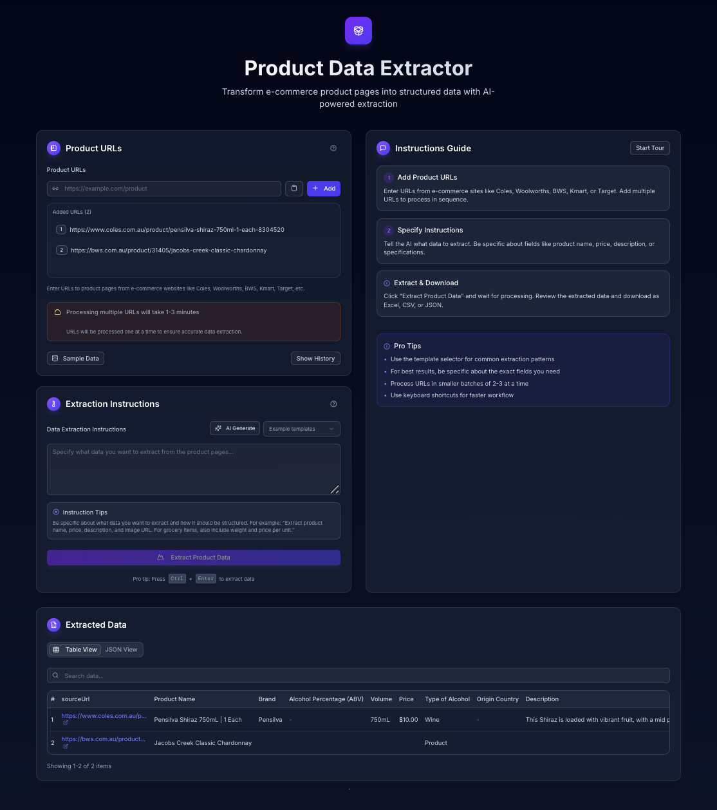

# E-commerce Product Data Extractor

A powerful tool for extracting structured product data from e-commerce websites using AI. This application can handle various e-commerce sites including Coles, Woolworths, Kmart, and more.



## Features

- Extract product data from multiple e-commerce websites
- Process multiple URLs in sequence
- Export data to Excel, CSV, or JSON
- View extraction history
- Responsive design for desktop and mobile
- Real-time progress tracking with redis

## Tech Stack

- **Framework**: Next.js 14 (App Router)
- **UI**: React, Tailwind CSS, shadcn/ui
- **AI**: OpenAI GPT models via AI SDK
- **Data Processing**: XLSX for spreadsheet generation
- **State Management**: React Hooks and Server Actions
- **Progress Tracking**: Upstash Redis for reliable progress updates

## Prerequisites

- Node.js 18.x or higher
- npm or yarn
- OpenAI API key
- Upstash Redis

## Environment Variables

Create a `.env.local` file in the root directory with the following variables:

```
OPENAI_API_KEY=your_openai_api_key
UPSTASH_REDIS_REST_TOKEN=
UPSTASH_REDIS_REST_TOKEN=
```

## Installation

1. Clone the repository:

   ```bash
   git clone https://github.com/Stefanuswilfrid/ai_data_processing.git
   cd ai_data_processing
   ```

2. Install dependencies:

   ```bash
   npm install
   # or
   yarn install
   ```

3. Run the development server:

   ```bash
   npm run dev
   # or
   yarn dev
   ```

4. Open [http://localhost:3000](http://localhost:3000) in your browser to see the application.

## Usage

1. **Enter Product URLs**: Add one or more URLs from supported e-commerce sites.
2. **Specify Instructions**: Tell the AI what data to extract (e.g., product name, price, description).
3. **Extract Data**: Click "Extract Product Data" and wait for the process to complete.
4. **View Results**: Review the extracted data in table or JSON format.
5. **Export Data**: Download the data in Excel, CSV, or JSON format.

## Supported Websites

The application can extract data from various e-commerce websites, including:

- Coles
- Woolworths
- Amazon
- JB Hifi
- Kmart
- Target
- And many more...

## Limitations

### BWS Extraction

BWS uses strong anti-scraping protections, making full data extraction difficult.

- **Current**: Extracts basic info from the URL and enriches with limited API data
- **Failed Approaches**: Browse.AI, Puppeteer (even with stealth), and direct API access
- **Potential Improvements**: Host Puppeteer on a private server with rotating residential proxies

---

## Project Structure

```
├── app/ # Next.js App Router
│ ├── actions.ts # Server Actions
│ ├── api/ # API Routes
│ └── page.tsx # Main page
├── components/ # React components
│ ├── data/ # Data display components
│ ├── inputs/ # Form input components
│ └── ui/ # UI components (shadcn)
├── lib/ # Utility functions
│ ├── types.ts # TypeScript types
│ └── utils/ # Utility functions
│ ├── bws-extractor.ts # BWS-specific extraction
│ ├── data-parser.ts # Parse AI responses
│ ├── html-extractor.ts # Extract relevant HTML
│ ├── logger.ts # Logging utility
| |-- redis-client.ts # redis
│ └── prompt-generator.ts # Generate AI prompts
├── public/ # Static assets
└── .env.local # Environment variables
```

## Manual Testing

For manual testing, you can use the sample URLs provided in the application. These URLs are pre-configured to test different extraction scenarios.

## Limitations

- Some websites may block automated access, resulting in limited data extraction.
- The AI extraction quality depends on the structure and consistency of the source website.
- Processing multiple URLs may take several minutes.

## Manual Testing Guide

To help evaluate this project, here's how to test it effectively:

### Guided Tour Feature

The application includes a guided tour for first-time users:

1. Click the "Start Tour" button in the Instructions Guide section
2. The tour will highlight key features and explain how to use them
3. You can exit the tour at any time by clicking outside the highlighted area

### Sample Data and Templates

For easy testing:

1. Click the "Sample Data" button to load pre-configured URLs
2. Use the template selector in the Extraction Instructions section for common extraction patterns
3. The AI Generate button can create extraction instructions based on the type of product

## Implementation Details

### Key Components

1. **Server Actions (`app/actions.ts`)**

   - Handles the core extraction logic using Next.js Server Actions
   - Processes URLs sequentially to avoid rate limiting
   - Implements different extraction strategies based on the website

2. **Progress Tracking System (`lib/utils/redis-client.ts`)**

   - Uses Upstash Redis for persistent progress storage
   - Generates unique extraction IDs for each job
   - Stores progress with expiration (30 minutes) to prevent Redis overflow
   - Provides methods for updating and retrieving progress

3. **Progress Communication (`app/api/extraction-progress/route.ts`)**

   - Implements Server-Sent Events (SSE) for real-time updates
   - Includes safeguards against "controller closed" errors
   - Provides fallback to direct API polling when SSE fails

4. **Client-Side Progress Handling (`components/progress-tracker.tsx`)**

   - Manages multiple connection methods (SSE and polling)
   - Implements reconnection logic with exponential backoff
   - Prevents premature 100% completion display
   - Uses smooth progress transitions for better UX

5. **BWS-Specific Extraction (`lib/utils/bws-extractor.ts`)**
   - Extracts basic product info from URL structure
   - Attempts to enrich data via BWS API endpoints
   - Implements fallbacks when API access fails

### Progress Calculation

The progress percentage is carefully calibrated to accurately reflect the extraction status:

- 0-80%: URL processing (divided proportionally among URLs)
- 80-90%: Data processing and spreadsheet generation
- 90-100%: Final steps and completion

This prevents the UI from showing 100% before the extraction is truly complete.

### Error Handling and Resilience

- **Retry Logic**: Implements exponential backoff for failed requests
- **Graceful Degradation**: Falls back to simpler extraction methods when advanced methods fail
- **Connection Recovery**: Automatically reconnects when progress tracking connections are lost
- **Cancellation Support**: Allows users to safely cancel ongoing extractions

### Common Issues

1. **Extraction fails for certain websites**:

   - Check if the website has anti-scraping measures.

2. **OpenAI API errors**:

   - Verify your API key is correct and has sufficient credits.
   - Check for rate limiting issues.
